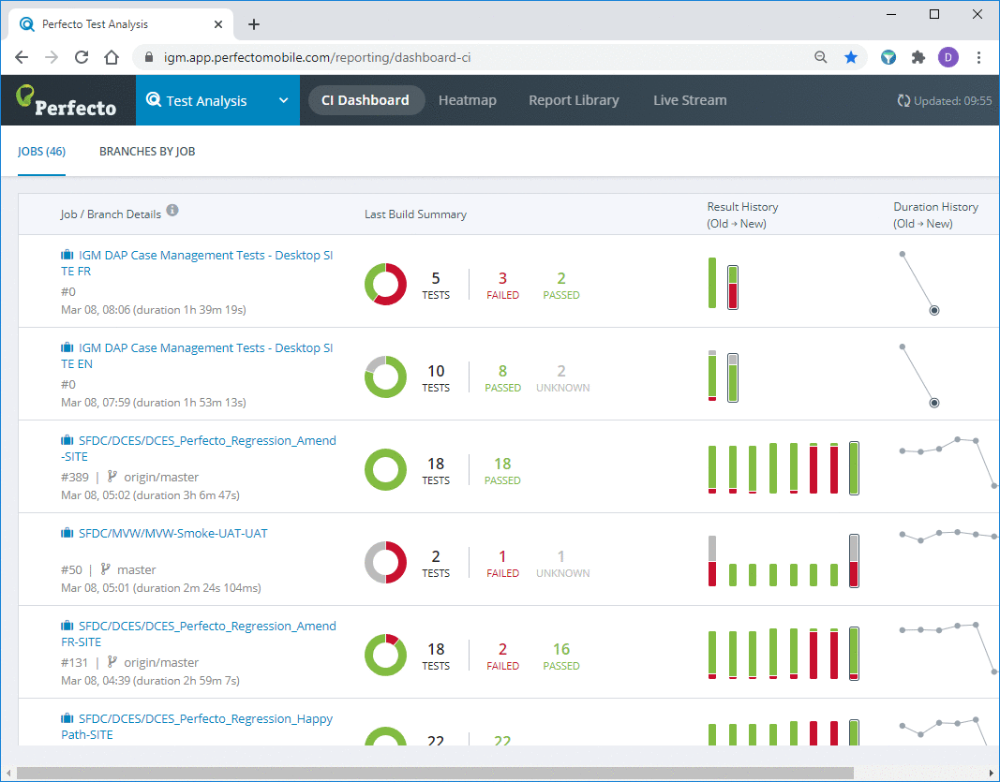

# perfecto-filter
Perfecto Filter is a Chrome extension for the users of perfectomobile.com continuous integration tool.
While Perfecto itself serves the goal of monitoring the results of test executions, it does not provide any tool to filter the results displayed on the CI dashboard.
This filter extension allows to filter those results by job name.

## Installation in Chrome
1. Download the git project to a local folder (make sure to copy the folder to a permanent location before adding it to Chrome).
2. Once you have your folder, go to the Extensions page in Chrome: chrome://extensions/ (or find it in your menu under More tools -> Extensions).
3. Enable Developer Mode by activating the switch in the top right corner.
4. Then to install the extension, click "Load unpacked" in the left top corner. You just have to indicate where this folder is on your computer.

## Using the Extension
- Once installed, the icon of the extension will appear on the extensions bar in Chrome (look for a teal-colored funnel).
- Open the Perfecto CI Dashboard page: https://your-company.app.perfectomobile.com/reporting/dashboard-ci
- Click on the extension icon - a pop-up window will appear next to it.
- Enter a part of your project name in the search bar.
- The list on the page will be filtered to contain your search term.
- To disable filtering, use the switch on the pop-up window.
